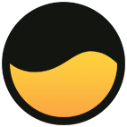
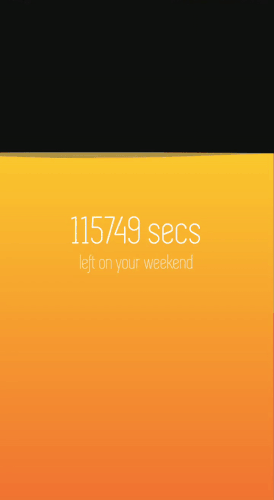

# Weekend Meter

  

This mobile app shows a visualization of the time you have left of your weekend. The golden liquid drains as your weekend passes by. Conversely, you'll only get a black screen with a message if its still not yet the weekend.

## About

- Framework: Flutter
- Font: Simplifica

## Running from Source

### Download Flutter

You can download Flutter from here: [Download Flutter](https://flutter.dev/docs/get-started/install)

Follow the instructions for the setup.

### Install Dependencies

To install the dependencies, use the command:

`flutter pub get`

### Run the App

To run the app, use the command:

`flutter run`

## Nice Things to Add

- [ ] Create a release APK and IPA
- [ ] Add a way to change the time when weekend starts on Friday
- [ ] Make it a live wallpaper!

## License

MIT License - See [License File](LICENSE)
